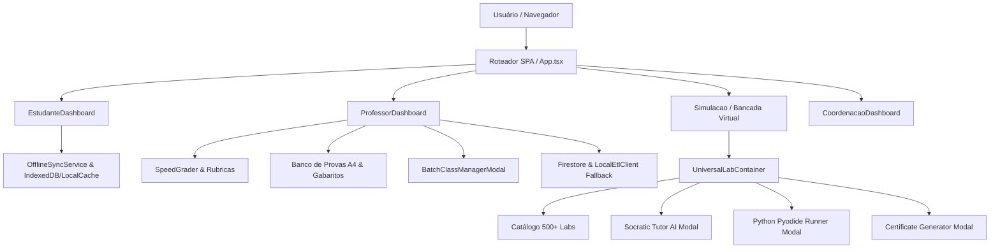

# 📘 Documento de Handover & Guia de Refinamentos Contínuos de UX
### Kortex Super LMS — Plataforma Educacional Integrada

---

## 1. Resumo Executivo & Estado Atual da Plataforma

A plataforma **Kortex Super LMS** consolidou-se como um ecossistema educacional de alta densidade pedagógica e tecnológica, integrando Ensino Médio, Preparatório ENEM e Ensino Superior (Engenharias, Saúde, Computação, Ciências Exatas e Humanas).

### 📊 Métricas Chave do Projeto:
* **Cobertura de Testes:** **118 testes unitários e de integração** aprovados em 18 suítes com **100% de taxa de sucesso** (`vitest`).
* **Estabilidade de Compilação:** Zero erros de tipagem estrita no TypeScript (`tsc -b`).
* **Performance de Bundle:** Catálogo de simulações desacoplado no chunk dedicado `labs-catalog` (~1.6 MB minificado isolado), garantindo carregamento inicial ultrarrápido das rotas centrais (bundle principal com apenas **61 kB**).
* **Deploy em Produção:** Ativo e funcional em **https://plataforma-educacional-73df6.web.app** via Firebase Hosting.
* **Ambiente Git:** Repositório sincronizado nas branches `dev` e `main` no GitHub (`https://github.com/Sanluis94/Plataforma-educacional.git`).

---

## 2. Mapa Arquitetural & Componentes Chave



### Arquivos Críticos do Sistema:
| Módulo / Camada | Arquivo Principal | Responsabilidade |
| :--- | :--- | :--- |
| **Bancada de Labs** | `src/modules/ux/components/UniversalLabContainer.tsx` | Renderização universal de parâmetros, sliders numéricos duplos, telemetria e gráficos. |
| **Catálogo de Labs** | `src/modules/data/catalogs/masterLabsCatalog.ts` | Metadados, equações, parâmetros e objetivos pedagógicos dos 500+ laboratórios. |
| **Estudante** | `src/modules/ux/pages/EstudanteDashboard.tsx` | Visão de turmas, progresso gamificado, matrícula por código e histórico de submissões. |
| **Professor** | `src/modules/ux/pages/ProfessorDashboard.tsx` | Gestão de turmas, SpeedGrader de rubricas, provas imprimíveis em A4 e IA assistente. |
| **Resiliência Offline** | `src/modules/core/services/offlineSyncService.ts` | Enfileiramento automático de dados e submissões quando sem conexão à internet. |
| **Modais & Diálogos** | `src/modules/ux/components/labs/*` | Suíte de modais ergonômicos (Escape listener, backdrop dismiss, scroll lock, ARIA). |

---

## 3. Matriz de Refinamentos Futuros e Oportunidades de UX

Para as próximas iterações da equipe, recomenda-se focar nestes eixos de refinamento sem necessidade de expandir escopos brutos:

### 🌟 Eixo 1: Acessibilidade & Navegação por Teclado (a11y)
1. **Command Palette (`Ctrl + K` / `Cmd + K`):**
   * *Oportunidade:* Permitir que professores e estudantes busquem instantaneamente qualquer um dos 500+ laboratórios, turmas ou tópicos digitando poucas letras, sem precisar rolar páginas longas.
2. **Regiões Dinâmicas de Leitura de Tela (`aria-live="polite"`):**
   * *Oportunidade:* Ao alterar parâmetros em sliders (ex: voltagem, temperatura ou vazão), fornecer anúncios de áudio concisos para leitores de tela como NVDA/Orca/VoiceOver.
3. **Preferência de Movimento Reduzido (`prefers-reduced-motion`):**
   * *Oportunidade:* Suavizar ou desativar animações de canvas ou CSS para estudantes com sensibilidade vestibular.

---

### 📱 Eixo 2: Experiência Mobile & Responsividade Tátil
4. **Bottom Sheet Móvel para Parâmetros da Bancada:**
   * *Oportunidade:* Em smartphones, transformar o painel de parâmetros do `UniversalLabContainer` em uma gaveta inferior deslizável (*bottom sheet*), liberando 100% da área útil da tela para a visualização gráfica ou simulador 2D/3D.
5. **Zoom e Pan Gestual (Pinch-to-Zoom):**
   * *Oportunidade:* Permitir zoom com dois dedos nos gráficos e diagramas anatômicos/circuitos em dispositivos touch.
6. **Estados Vazios Elegantes (*Empty States* Ilustrados):**
   * *Oportunidade:* Nas seções de turmas ou submissões sem itens, apresentar ilustrações vetoriais convidativas com botões diretos de ação primária (Call-to-Action).

---

### 👨‍🏫 Eixo 3: Ergonomia do Professor & SpeedGrader
7. **Atalhos de Teclado no SpeedGrader:**
   * *Oportunidade:* Teclas `J` (estudante anterior) e `K` (próximo estudante), além de teclas numéricas `1-5` para preenchimento ágil de notas de critérios de rubricas.
8. **Filtro Avançado de Entregas:**
   * *Oportunidade:* Adicionar abas rápidas no SpeedGrader: *"Pendentes de Correção"*, *"Corrigidos"*, *"Nota Máxima"* e *"Abaixo da Média"*.
9. **Exportação de Pautas em Excel/CSV:**
   * *Oportunidade:* Botão de 1 clique para exportar a planilha de notas da turma com notas de rubricas e pareceres já formatados para a secretaria acadêmica.

---

### ⚡ Eixo 4: Microinterações, Feedback & Performance
10. **Toast Notifications Não-Bloqueantes:**
    * *Oportunidade:* Substituir qualquer feedback restante por um container global de notificações toast (com ícones de sucesso, aviso e erro, auto-dismiss e pausa ao passar o mouse).
11. **Indicador Visual de Conectividade & Fila Offline:**
    * *Oportunidade:* Um pequeno badge sutil no cabeçalho (*Pill* verde "Conectado" ou amarelo "Modo Offline - X itens na fila"), informando ao usuário quando a sincronização em segundo plano estiver operando.
12. **Prefetching com Mouse Hover:**
    * *Oportunidade:* Ao passar o cursor do mouse sobre o card de um laboratório no catálogo, disparar o pré-carregamento preguiçoso do respectivo simulador para abertura instantânea (0ms de latência percebida).

---

## 4. Guia Operacional de Desenvolvimento & Manutenção

### Comandos do Dia a Dia (Terminal PowerShell no Windows):
> [!IMPORTANT]
> No Windows PowerShell, scripts `.ps1` podem requerer chamada direta via `cmd.exe /c` para comandos npm/npx se as políticas de execução locais estiverem restritivas.

```powershell
# 1. Rodar a aplicação em modo de desenvolvimento com Hot Module Reload (HMR)
cmd.exe /c "npm run dev"

# 2. Executar a suíte completa de testes automatizados
cmd.exe /c "npm test"

# 3. Executar checagem de tipos estrita do TypeScript e build de produção
cmd.exe /c "npm run build"

# 4. Publicar atualização em produção no Firebase Hosting
cmd.exe /c "npx firebase-tools deploy --only hosting"
```

### Boas Práticas Estabelecidas no Código:
* **Resiliência Dual (Online + Fallback Local):** Todo repositório (`classRepository`, `submissionRepository`) deve manter o padrão de tentar a persistência no Firestore e, em caso de erro de rede ou permissão, gravar no armazenamento local (`localEtlClient`), garantindo que o usuário nunca seja bloqueado de estudar ou lecionar.
* **Compatibilidade de Códigos de Turma:** Manter o suporte bidirecional: códigos curtos alfanuméricos de 6 dígitos gerados pelo professor e identificadores UUID legados.
* **Modais Padronizados:** Sempre aplicar os hooks de captura de `Escape`, bloqueio de rolagem do body e dismiss de clique externo ao criar ou alterar qualquer janela modal.

---

*Documento gerado para servir de referência definitiva para transição técnica, manutenibilidade contínua e evolução de UX da plataforma Kortex Super LMS.*
